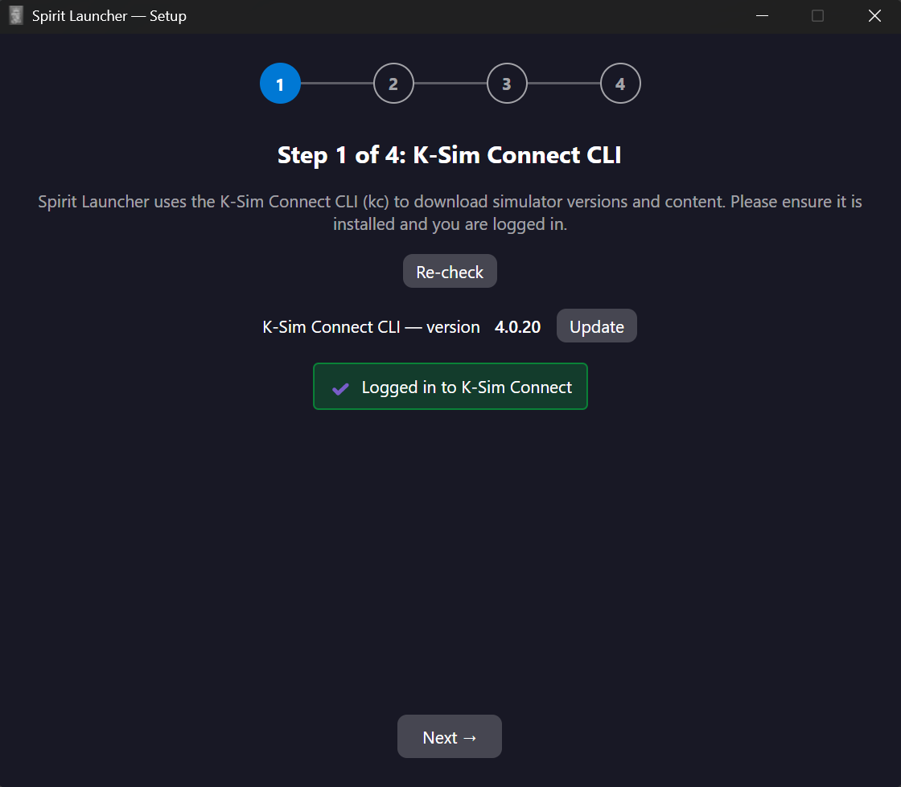
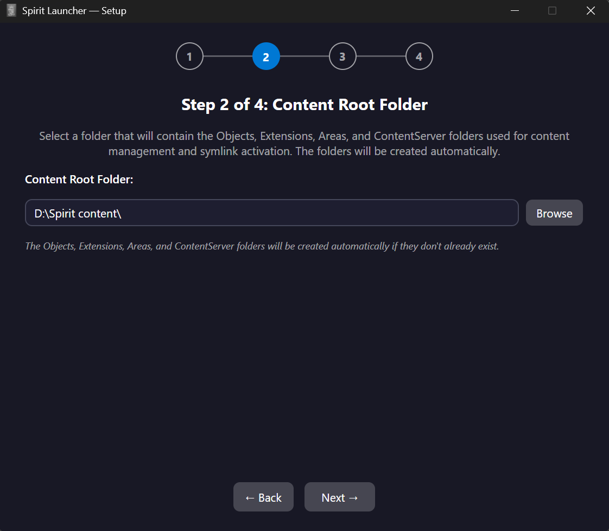
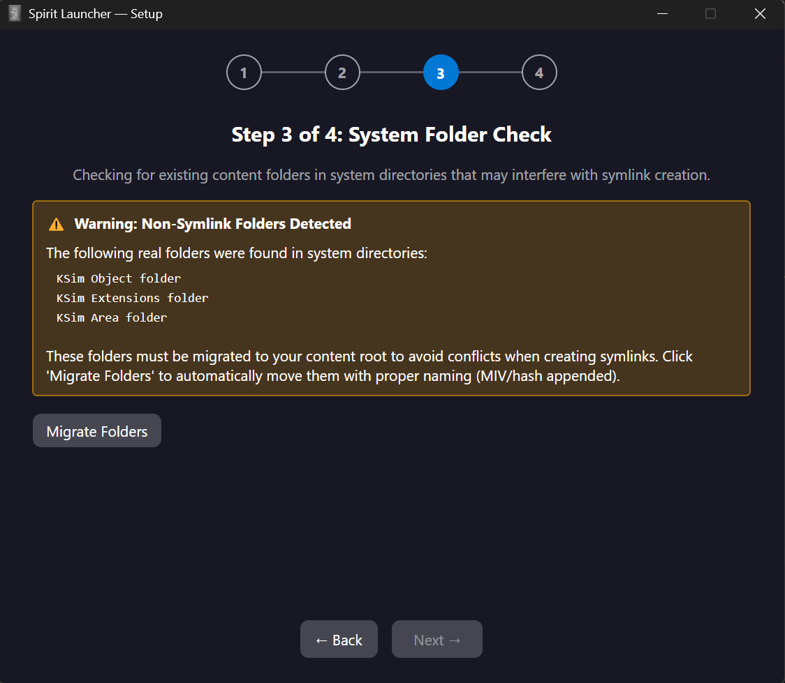
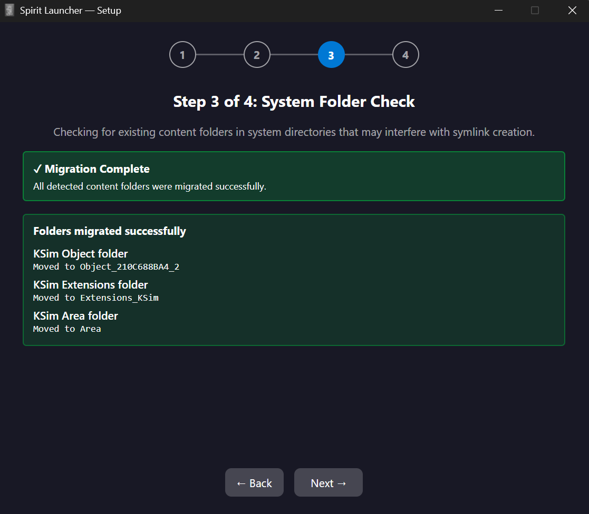
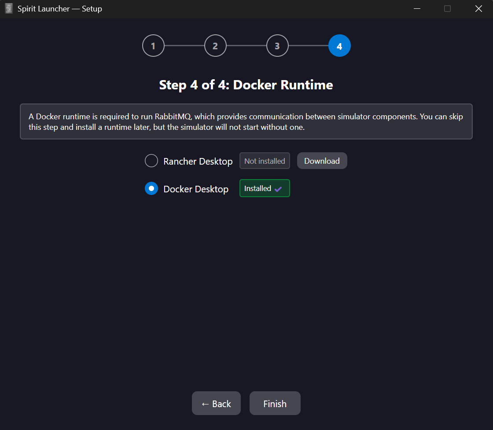

# Onboarding

Use this page while you move through the first-run setup in Spirit Launcher.

## Step 1: K-Sim Connect CLI

Install the K-Sim Connect CLI if it is missing, then confirm Spirit Launcher can detect it.
Use Login to authenticate in your browser so downloads work before you continue.
If an update is available, run it here so the launcher uses the current CLI version.
Continue only when the step shows both CLI detection and login success.

## Step 2: Content Root Folder

Choose one root folder for all shared simulator content.
Spirit Launcher creates the Objects, Extensions, Areas, and ContentServer folders for you.
Pick a location with enough space to hold content for multiple spirit version. 
This folder becomes the base for all content downloads.

## Step 3: System Folder Check

Spirit Launcher scans the K-Sim and Nemo system folders for real content folders that can block symlinks.
If conflicts are found, use Migrate Folders to move them into your content root with safe names.
You **cannot** continue until the warning is cleared or the migration completes.

After migration is completed and successfull you will see **Migration Completed**

## Step 4: Docker Runtime

Pick a supported Docker runtime so RabbitMQ can run when Spirit starts.
If nothing is installed, use one of the download options or finish and install it later.
Use Rancher Desktop if you have not gotten a lisense by KM to use Docker desktop.

