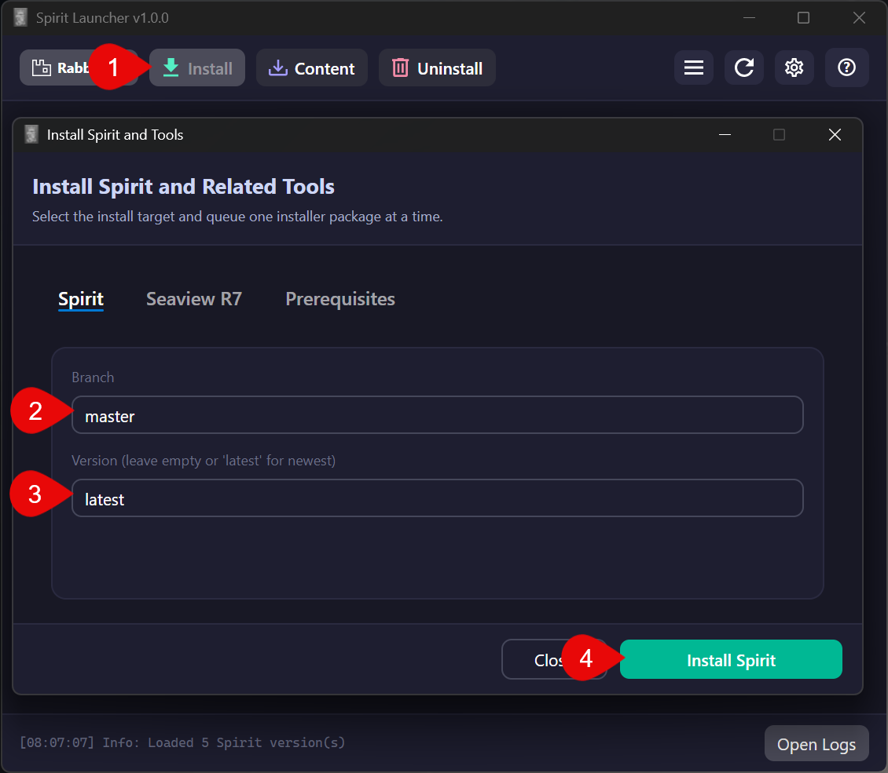
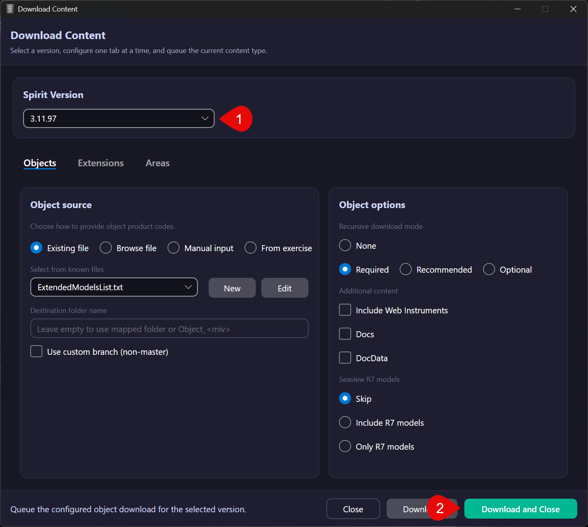
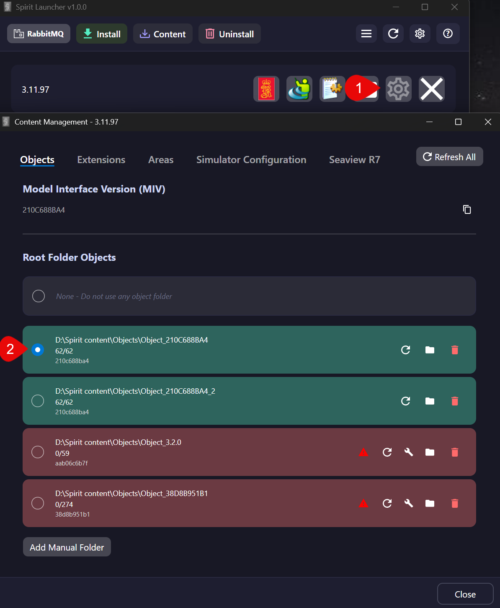
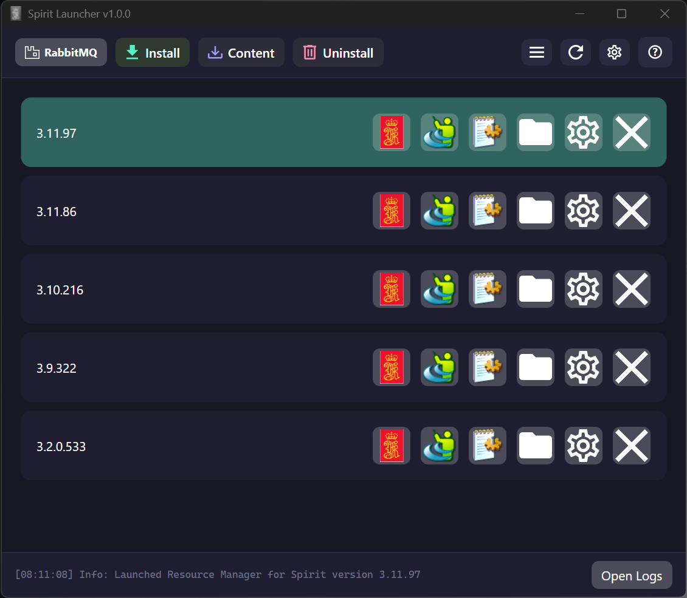
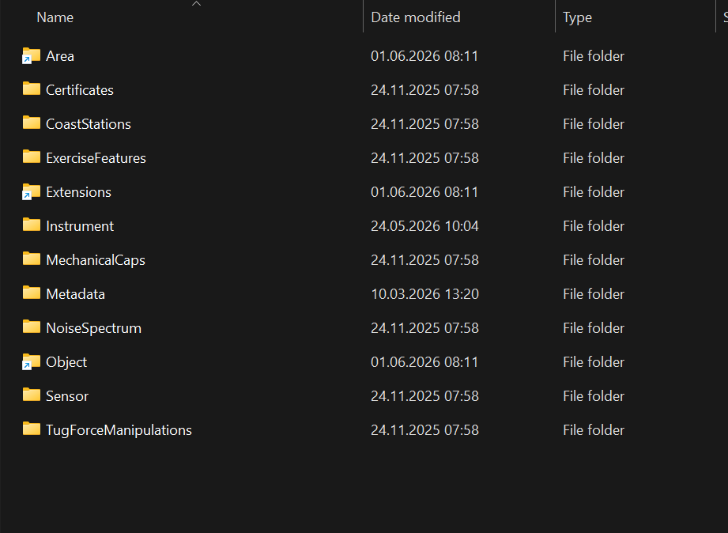

# Quick Start

This guide covers the shortest path to getting a Spirit version installed, started, and supplied with content.
Use it when you want the main workflow only.
Add screenshots where they help, but keep the steps focused.

## 1. Download Spirit

Open Spirit Launcher and click Install.
Use the Spirit tab, choose the branch you need, and leave the Version as **latest** to get the latest build unless you need a specific one.
Start the install to download and install that version of spirit. All downloaded installers will automatically be cleaned up after installation. 

## 2. Download Content

Open Download Content and choose the installed Spirit version you want to prepare.
Download the Objects, Extensions, or Areas you need from the relevant tab.
The queue shows progress, and downloaded content is placed under your configured content root.

## 3. Manage Content For a Version

Click the gear button on a Spirit version to open content management.
Select the object, extension, and area folders you want that version to use.
Re-validate or fix incompatible folders when needed, then close the window to keep working with that version.

## 4. Start Spirit

Use the Kongsberg button on the version card to launch Resource Manager for that installed version.
Wait until the version is fully loaded and ready before starting related tools.
If the simulator depends on Docker and RabbitMQ, make sure your selected runtime is installed and running.
A running version is indicated with a green background. 

When resource manager is started, Spirit Launcher creates a symlink from the selected Object, Extension and Area folder for the version started to C:\ProgramData\Kongsberg\KSim\System
The Symlinked folder will have a arrow in the folder icon. From spirit point of view its like the folders are there, but in reality they live inside the content root folder. 
Any changes made to the content root folder applies to the content in the linkes folder. 

